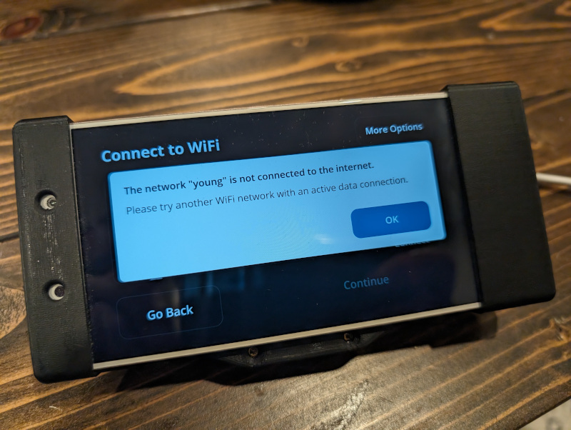

# C2 NEOS Alternate Fix Install

Stuck on the NEOS setup screen? You're not alone.

You get this message after "Connect to Wi-Fi":

> The network "xxxx" is not connected to the internet.



comma.ai no longer has a working endpoint for the setup tool to use to determine if the device is connected to the internet. This means that the NEOS setup screen after selecting a Wi-Fi network will always show "The network 'xxxx' is not connected to the internet" even when it is.

This repository provides a simple, all-in-one tool to bypass the NEOS Setup screen and install openpilot-JVE on a **comma two**, or a comma two clone device. This is **NOT** designed or needed for AGNOS devices such as the comma three.

Note that it also patches the target installation of openpilot to point to a rehosted OS image that comma no longer hosts.

If you have other comma two issues or want to contribute documentation and wisdom, please check out the [ophwug/docs repo](https://github.com/ophwug/docs?tab=readme-ov-file#common-to-all-comma-two-family-devices).

## Usage

This tool can be run on Windows, macOS, or Linux.

### Prerequisites

1.  **Connect to Wi-Fi**
    *   On your comma two, connect to the **same Wi-Fi network** as the computer you are using to run this tool.

2.  **Find Your Device's IP Address**
    *   On the device, go to **More Options**.
    *   Touch the triple-dot icon in the upper right corner and select **Advanced**.
    *   Scroll down and note the **IPv4 address**. It will likely start with `192.168.x.x`, `10.x.x.x`, or `172.16.x.x`.

### Fork Selection

Upon running the installer, you will be prompted to select a fork of openpilot to install. This modified build defaults to installing [`realfast/openpilot-JVE`](https://github.com/realfast/openpilot-JVE) from the `jvePilot-release` branch. You can also opt to install a custom fork by providing the GitHub owner, repository name, and branch name.

### Windows Instructions

#### For Most Users (Graphical Interface)

1.  **Download the Installer**
    *   [**Click here to download `c2-neos-alt-fix-install.exe`**](https://github.com/ophwug/c2-neos-alt-fix-install/releases/latest/download/c2-neos-alt-fix-install.exe)
    *   Save the file to a convenient location, like your Downloads folder.

2.  **Run the Installer**
    *   Find the `c2-neos-alt-fix-install.exe` file you downloaded.
    *   **Double-click** the file to run it.
    *   The application will open a command prompt-like window and guide you through the rest of the process.
    *   When the process is finished, the window will stay open until you press the Enter key.

#### For Command-Line Users

This alternative launch method may be useful if this tool crashes for some reason and error messages are needed. 

1.  **Download and Run the Installer**
    *   Open your preferred command-line tool (**Command Prompt** or **PowerShell**).
    *   Copy and paste the appropriate command below and press Enter.

    **For Command Prompt:**
    ```cmd
    curl -L "https://github.com/ophwug/c2-neos-alt-fix-install/releases/latest/download/c2-neos-alt-fix-install.exe" -o "c2-neos-alt-fix-install.exe" && c2-neos-alt-fix-install.exe
    ```

    **For PowerShell:**
    ```powershell
    Invoke-WebRequest -Uri "https://github.com/ophwug/c2-neos-alt-fix-install/releases/latest/download/c2-neos-alt-fix-install.exe" -OutFile "c2-neos-alt-fix-install.exe" ; ./c2-neos-alt-fix-install.exe
    ```
    *   The application will then guide you through the rest of the process.

### macOS Instructions

⚠️ **IMPORTANT: Network Access Permission**

If you recently installed or reinstalled your terminal application (Terminal, iTerm2, etc.), macOS may have asked you to grant network access permission. **If you accidentally denied this permission, all network commands in your terminal will fail, including this installer.**

**Symptoms of missing network permission:**
- `curl`, `ssh`, `ping`, and other network commands fail with errors like "No route to host" or connection timeouts
- The same commands work in other apps like Safari or a different terminal app
- You may see errors about not being able to connect to the device

**To check and grant network permission:**
1. Open **System Settings** (or **System Preferences** on older macOS versions)
2. Go to **Privacy & Security** → **Local Network** (or search for "network" in settings)
3. Find your terminal application in the list (Terminal, iTerm2, etc.)
4. Ensure the toggle next to it is **enabled**
5. If your terminal app is not listed, try restarting it - macOS should prompt you for permission
6. After granting permission, restart your terminal and try again

For more details, see: https://gitlab.com/gnachman/iterm2/-/issues/12071

---

1.  **Run the Installer**
    *   Open the **Terminal** application on your Mac.
    *   Copy and paste the following command into the Terminal and press Enter. This will download, make executable, and run the installer in one step.
        ```bash
        curl -L https://github.com/ophwug/c2-neos-alt-fix-install/releases/latest/download/c2-neos-alt-fix-install-darwin -o c2-neos-alt-fix-install-darwin && chmod +x c2-neos-alt-fix-install-darwin && ./c2-neos-alt-fix-install-darwin
        ```
    *   The application will then guide you through the rest of the process.

2.  **If macOS Blocks the Unsigned Binary**
    *   macOS may prevent the unsigned binary from running with an error like "Apple could not verify [binary] is free of malware."
    *   To allow Terminal to run unsigned binaries, add Terminal as a Developer Tool:
        1.  Open **System Settings**
        2.  Search for **"developer"**
        3.  Click **"Allow applications to use developer tools"** in the sidebar
        4.  If Terminal is not already listed, click the **+** button and search for **Terminal** to add it
        5.  Ensure the toggle next to Terminal is **enabled**
        6.  Restart Terminal and run the installer again:
            ```bash
            ./c2-neos-alt-fix-install-darwin
            ```
    *   For more detailed information with screenshots, see: [https://donatstudios.com/mac-terminal-run-unsigned-binaries](https://donatstudios.com/mac-terminal-run-unsigned-binaries)

### Linux Instructions

1.  **Run the Installer**
    *   Open a **Terminal** on your Linux distribution.
    *   Copy and paste the following command into the Terminal and press Enter. This will download, make executable, and run the installer in one step.
        ```bash
        curl -L https://github.com/ophwug/c2-neos-alt-fix-install/releases/latest/download/c2-neos-alt-fix-install-linux -o c2-neos-alt-fix-install-linux && chmod +x c2-neos-alt-fix-install-linux && ./c2-neos-alt-fix-install-linux
        ```
    *   The application will then guide you through the rest of the process.

## Device Recovery

If you install software that causes your device to fail to boot, you can perform a system reset to restore it.

1.  **Enter Recovery Mode**
    *   With the device off but plugged in, press and hold the **Volume Down + Power** buttons simultaneously until the device boots into Recovery Mode.
    *   **Note:** The touchscreen will not work in Recovery Mode.

2.  **Perform a Reset**
    *   In Recovery Mode, you can choose to perform a **System Reset** or a **Factory Reset**. A system reset is usually sufficient.
    *   Use the **Volume Up** and **Volume Down** buttons to navigate the menu and the **Power** button to confirm your selection.

3.  **Reboot**
    *   After the reset is complete, unplug the device and then plug it back in to power it on.

## For Developers

If you want to build the application yourself:

1.  Clone this repository.
2.  Make sure you have Go installed (version 1.22 or later).
3.  Run `make` to build the Windows, macOS, and Linux executables.
4.  Run `make run` to run the application for development.

The build process is automated via GitHub Actions. Every push to the `main` branch will trigger a new build and update the "Latest Build" release.

## Credits

This project is a Go-based evolution of the [original shell script installer created by jyoung8607](https://github.com/jyoung8607/neos-manual-install). A big thank you for the original work and inspiration!

It was mostly coded with Roo Code and Gemini Pro 2.5.
